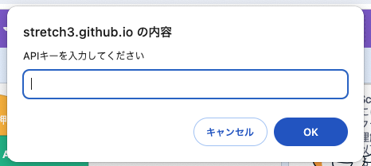
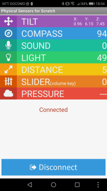

<style>
    h1 {
        page-break-before:always; <!-- Auto page break at Headding1 -->
    }
</style> 

# Scratch Hacks!!<!-- omit in toc -->

筆者:武藤武士 (X:@610t)

# はじめに
みなさん、Scratchはご存知ですか?
ブロックを積み重ねてプログラムを創るScratchは、ひょっとしたら学校や[CoderDojo](https://coderdojo.jp/)などで使ったことがあるかもしれません。

本書では、Scratchの基礎などについては、一切説明しません。
良書がたくさんでているので、それらを参考にしてくだい。

私が初めてScratchと出会ったのは、「Scratch: A Sneak Preview」という論文を読んだことでした。
この時は、まだアルファ版で一般公開されておらず、今とはかなり雰囲気の異なる環境でした。
この論文ではあまりそのスゴさ理解できていなかったのが、私の先見の明がなかったところです。

当時は、[Squeak](https://squeak.org/)というブロックプログラミングに似たタイルスクリプティングベースの環境で遊んでいました。
C5という京都大学で行われていた国際会議なども定期的に行われており、Squeakに関連した人たちが多く参加していました。

Squeakの時代から、その言語環境内で閉じるのではなく、外部のデバイスと一緒に使う試みがたくさんありました。
Scratchの場合は公式拡張機能を使ってLEGOシリーズやmicro:bitと一緒に使えることを知っている人も多いかもしれません。
こういうデバイスと一緒にScratchを使うことは、私にとっては大好物です。

本書ではこれらを踏まえて、Scratchの少し(?)変わった使い方の紹介をします。

以下のようなデバイスやサービスをScratchと一緒に使用します。

デバイスとしては、以下のようなものを使用します。
各デバイスの詳しい使い方についても、もうしわけありませんが、本書では説明しません。
動作に必要な最低限の説明だけを行います。
- M5Stack
  - ｽﾀｯｸﾁｬﾝ
- micro:bit
- AkaDako
- hapStak
- LEGO
- Seeeduino XIAOシリーズ, WioTerminal

また、以下のようなサービスを利用します。
- IFTTT
- ChatGPT
- [TBD]TeachableMachine
- [TBD]音声認識
- [TBD]画像分類器
- [TBD]ポーズ認識

みなさんのScratchライフが楽しいものになれば筆者としてはうれしいです。

Happy Scratch Hacking!!

# 目次
- [はじめに](#はじめに)
- [目次](#目次)
- [Scratchってなぁに?](#scratchってなぁに)
  - [Scratch拡張機能](#scratch拡張機能)
    - [独自の拡張機能を追加したScratch拡張サーバー](#独自の拡張機能を追加したscratch拡張サーバー)
- [Stretch3(ストレッチスリー)](#stretch3ストレッチスリー)
  - [Microbit More拡張機能](#microbit-more拡張機能)
  - [AkaDako拡張機能](#akadako拡張機能)
    - [参考文献](#参考文献)
  - [音声認識拡張機能(Speech2Scratch)](#音声認識拡張機能speech2scratch)
  - [IFTTT Webhooks拡張機能](#ifttt-webhooks拡張機能)
    - [IFTTT側での設定](#ifttt側での設定)
    - [Scratchでのプログラミング](#scratchでのプログラミング)
      - [デモ: 侵入検知器](#デモ-侵入検知器)
      - [デモ:　音声入力翻訳システム](#デモ音声入力翻訳システム)
      - [デモ: りんごを食べようゲーム](#デモ-りんごを食べようゲーム)
  - [ChatGPT拡張機能(CHATGPT2Scratch)](#chatgpt拡張機能chatgpt2scratch)
  - [TeachableMachineに関する拡張機能](#teachablemachineに関する拡張機能)
  - [画像分類器拡張機能](#画像分類器拡張機能)
  - [ポーズ認識に関する拡張機能](#ポーズ認識に関する拡張機能)
- [M5Stackと遊ぼう!!](#m5stackと遊ぼう)
  - [M5Stackってなぁに?](#m5stackってなぁに)
  - [M5StackとScratchで遊ぶための参考文献](#m5stackとscratchで遊ぶための参考文献)
- [M5bitLess = M5Stack x Scratch:M5StackでMicrobit Moreを使う](#m5bitless--m5stack-x-scratchm5stackでmicrobit-moreを使う)
  - [参考文献](#参考文献-1)
  - [その他のマイコンボードで\*bitLess系列を使う](#その他のマイコンボードでbitless系列を使う)
      - [参考文献](#参考文献-2)
- [Scratch1.4と遠隔センサープロトコル](#scratch14と遠隔センサープロトコル)
  - [Scratch 1.4](#scratch-14)
  - [遠隔センサープロトコル(RSP)](#遠隔センサープロトコルrsp)
    - [AndroidでのRSPの利用](#androidでのrspの利用)
  - [Scratch x M5Stack UIFlow](#scratch-x-m5stack-uiflow)
- [M5Scratch = Scratch x M5Stack:M5StackでScratch遠隔センサーを使う](#m5scratch--scratch-x-m5stackm5stackでscratch遠隔センサーを使う)
  - [参考文献](#参考文献-3)
- [スーパーかわいいロボットｽﾀｯｸﾁｬﾝ](#スーパーかわいいロボットｽﾀｯｸﾁｬﾝ)
  - [音声入出力を使ってｽﾀｯｸﾁｬﾝと遊ぼう](#音声入出力を使ってｽﾀｯｸﾁｬﾝと遊ぼう)
    - [参考文献](#参考文献-4)
  - [M5bitLessを使ってｽﾀｯｸﾁｬﾝと遊ぼう](#m5bitlessを使ってｽﾀｯｸﾁｬﾝと遊ぼう)
- [Scratchサーバーを自分で立ち上げる](#scratchサーバーを自分で立ち上げる)
  - [拡張機能を追加する](#拡張機能を追加する)
  - [他のPCからこのサーバの全機能を利用する](#他のpcからこのサーバの全機能を利用する)
  - [参考文献](#参考文献-5)
- [おわりに](#おわりに)
- [奥付](#奥付)

# Scratchってなぁに?


[Scratch](https://scratch.mit.edu/)はMITメディアラボが開発したプログラミング言語です。
プログラムは、ブロックを積み上げて創っていきます。
しばしば、小学校などのようなプログラミング学習の入門用の教育用途で利用されています。
作者たちのスローガンは、「全ての年齢の子どもたちに!!」であり、大人の利用も視野に入っています。

Scratchは教育用途という先入観があると思いますが、作者たちは、以下のような多様な用途に利用できるように設計をしています。
- 低い床:		はじめやすく
- 高い天井:	高度なこともでき
- 広い壁:		いろいろなものを作れる

個人的には、少し変わった変態言語と感じています。
詳しくは説明しませんが、例えば以下のような特徴があります。
- 並列実行: プログラムはごく自然に並列に実行するように書かれます。
- イベントベース: プログラムは、イベントの送受信を使って書かれます。
- オブジェクトベース: 全てはオブジェクトです。
  - スプライト: 表示されているキャラクターはオブジェクトです。
  - クローン: スプライトは複製を作ることができ、これも自律的に動かせます。

公式Scratchサーバーは https://scratch.mit.edu/ で公開されています。

Scratchのサーバーはオープンソースで公開されいます。
そのため、比較的簡単に自分好みのサーバを創ることもできるようになっています。
これを自分の手元で立ち上げる方法も本書では解説します。

## Scratch拡張機能
Scratchには拡張機能という仕組みがあり、その機能を簡単に追加していくことができるようになっています。
公式のScratchサーバーで利用できる拡張機能は以下の図のようなものです。


一見基本的にみえる「ペン」や「音楽」などの他に、文字列を翻訳する「翻訳」や文字列を音声合成して読み上げる「音声合成」、ビデオ入力から動きを検知する「ビデオモーションセンサー」などがあります。
ハードウエアとしては、「micro:bit」やLEGO(MINDSTORMS EV3, BOOST, WeDo)などが利用可能になっています。

拡張機能は、ユーザーから見ると他のScratchの基本的な機能と変わりなく利用可能です。

サーバー開発者から見ると、Scratchに機能を追加するためのフレームワークになっています。
これを使うことで、比較的簡単にScratchに機能を追加することができるのです。

### 独自の拡張機能を追加したScratch拡張サーバー
Scratchの拡張機能を独自に追加したサーバー(以下、拡張サーバー)も各所で提供されています。

例えば、以下のような拡張サーバーがあります。
- [Stretch3](https://stretch3.github.io/):AI系に強い
- [Xcratch](https://xcratch.github.io/editor/):	拡張機能動的追加型
- [blicklife](https://bricklife.com/scratch-gui/):	LEGOに強い
- [toioDo](https://toio.github.io/toio-visual-programming/beta/):	Sony [toio](https://toio.io/)用環境
- [CodeSkool](https://ide.codeskool.cc/):	なんかいっぱい
- [つくるっち](https://sohta02.sakura.ne.jp/tukurutch/):	ハードウエア系に強い

本書では、Stretch3を使っていきます。

> [!CAUTION]
> 拡張サーバーでは、クラウドへのコード保存ができませんので、明示的に自分でダウンロードして保存する必要があります。

# Stretch3(ストレッチスリー)
[Stretch3](https://stretch3.github.io/)(ストレッチスリー)は、公式の拡張機能以外に主に日本の開発者たちが開発した拡張機能が利用できるようにしたScratchサーバーです。
これらの拡張機能は、主に日本の開発者たちが開発しており、オープンソースで公開されています。

Stretch3の拡張機能には、以下の図のようなものがあります。


今回、本書で解説しようと考えている拡張機能は、以下のとおりです。
- Microbit More
- AkaDako
- LEGO DUPLO Train
- IFTTT
- ChatGPT(ChatGPT2Scratch)
- [TBD]TeachableMachine(TM2Scratch, TMPose2Scratch)
- [TBD]音声認識(Speech2Scratch)
- [TBD]画像分類器(ImageClassifier2Scratch)
- [TBD]ポーズ認識(Posenet2Scratch, Facemesh2Scratch, Handpose2Scratch)

## Microbit More拡張機能
[Microbit More](https://microbit-more.github.io/)は、Scratchから[micro:bit](https://microbit.org/)のフル機能を利用できるようにした拡張機能です。
「公式にも拡張機能があるのでは?」と思うかもしれませんが、こちらはかなり機能が限定されており、私はMicrobit Moreを利用することをおすすめします。
以下のような違いがあります。

||micro:bit拡張機能|Micorbit More|
|---|---|---|
|ボタン|o|o|
|LED表示|o|o|
|簡易な状態による操作|o|o|
|加速度の利用|x|o|
|ピンの利用|限定的|完全に利用可能|

Microbit Moreはmicro:bitでの利用の他に、拙作のM5bitLessを使って、M5Stackシリーズのマイコンで利用することも可能です。
詳細は、[M5bitLess = M5Stack x Scratch:M5StackでMicrobit Moreを使う](#m5bitless--m5stack-x-scratchm5stackでmicrobit-moreを使う)でご紹介します。

## AkaDako拡張機能


[AkaDako](https://akadako.com/)は[TFabWorks](https://tfabworks.com/)によって開発および販売されている、Scratch用のGroveシールドです。
USBで有線接続するため、Bluetoothなどのような無線を使った接続のものより、安定して利用することが可能です。
教育向け用途を志向しており、各種学習単元に沿った実験ができるようになっています。

AkaDakoは、amazonやTFab Worksオンラインショップ、スイッチサイエンスなどで一般向け販売も行われています([製品ページ](https://akadako.com/product/))。

Groveとは、Seeedが中心となって進めているハードウエアを接続するためのインターフェースです。
Groveには、デジタルI/O、アナログI/O、I2Cの3種類があり、Grove対応の様々なデバイスを接続することが可能になっています。

AkaDakoでは、2つのアナログ入力端子と、2つのデジタル入力端子がGrove以外にも用意されています。
更に、初めから光センサーや加速度計や距離などのセンサーや、サーボモータやLEDアレイなどのアクチュエータがブロックで簡単に利用可能になっています。

AkaDakoで利用可能なブロックは、以下の図のようになります。


標準で多くのセンサーやアクチュエーターに対応しています。
もちろん、オンボードでこれらが用意されているものは、すぐに利用可能です。

更に、I2Cに対する操作ができるブロックも用意されているため、対応されていないI2Cデバイスを利用することも可能になっています。
例えば、I2C接続の環境光センサーのBH1750で明るさを取得するコードは、以下の図のようになります。


### 参考文献
- [ビジュアルプログラミングでブルブルブルッ](https://scrapbox.io/M5S/%E3%83%93%E3%82%B8%E3%83%A5%E3%82%A2%E3%83%AB%E3%83%97%E3%83%AD%E3%82%B0%E3%83%A9%E3%83%9F%E3%83%B3%E3%82%B0%E3%81%A7%E3%83%96%E3%83%AB%E3%83%96%E3%83%AB%E3%83%96%E3%83%AB%E3%83%83):AkaDakoとhapStakを使って、入力でブルブル震えるシステムを作ってみました。

## 音声認識拡張機能(Speech2Scratch)
音声認識拡張機能(Speech2Scratch)は、その名前のとおりで、マイクから入力した音声をテキストに変換してくれる機能です。
Scratchにはテキストを翻訳したり、音声で読み上げたりする機能があるので、組み合わせると面白い作品が作れます。

ブロックは２種類しかありません。


少し使い方にコツがいるので、動作例を紹介します。
はじめに、[音声認識開始]ブロックで音声認識をはじめます。
音声が認識されるまでは、[音声]ブロックには何も文字列が入らない空文字列になるので、文字列が入るまで待機します。
文字列が入ったら、その文字列に対して処理を行うという手順になります。


[音声入出力を使ってｽﾀｯｸﾁｬﾝと遊ぼう](#音声入出力を使ってｽﾀｯｸﾁｬﾝと遊ぼう)では、音声認識を使ってｽﾀｯｸﾁｬﾝと遊ぶ例もご紹介します。

## IFTTT Webhooks拡張機能
[IFTTT](https://ifttt.com/)は、IoT(Internet of Thinks)でよく使われるサービスです。
IoTとは、なんでもインターネットにつないで、何かをしようということです。
ここで、つなぐものは後で出てくるM5Stackのようなマイコンだったり、スマートセンサー類だったりします。

IFTTTでは、その名のとおり、IFに相当する特定のイベント(トリガー)が発生した時に、THENに相当する色々なサービス(アクション)を行うというような動作をします。
サービスの部分では、例えばLINEや電子メールなどにメッセージを送ったり、スプレッドシートに書き込んだりなど色々なことができます。

[IFTTT Webhooks](https://github.com/NorifumiOgawa/iftttWebhooks)拡張機能はScratchからIFTTTのWebhook機能を利用するための拡張機能です。
トリガーとしてWebhookを利用しており、3つまでの値が送れるようになっています。

> [!NOTE]
> 現在、IFTTTの無料サービスでは、Webhookは利用できません。
> 有料プランを利用するか、無料トライアルを利用する必要があります。

### IFTTT側での設定
今回のデモでは、すべてトリガーとしてWebhookを使い、アクションとしてはLINE Notifyを使います。
ここでは、その設定に関して説明していきます。

アプレットの構成は、以下の図のようになります。


はじめに、トリガーであるWebhookを設定します。
後で使うキーは、WebhookのURLの末尾に記述されています。


次にアクションであるLINE Notifyの設定です。
LINEとの接続部分に関しては省略しますが、指示どおりに設定していけば大丈夫です。


### Scratchでのプログラミング
IFTTT Webhooks拡張機能には、以下のようなブロックがあります。


使い方は、以下のような流れになります。
-	IFTTT Webhookアプレットを利用する場合keyが必要なので、これを与える必要があります(［IFTTT key:(key)］ブロック)。
		keyはWebhook URLの最後にある文字列です。
-	イベント名でどのアプレットが使われるか指定するので、これを適切に設定する必要があります(［IFTTT event:(event_name)］ブロック)。
	値は3つまで利用でき、それぞれ`value1, value2, value3`(［value1を(value1)にする］などのブロック)が利用できます。
-	最後に［送る］ブロックでデータが送られます。

以下、Scratchでのプログラムの例を示します。

#### デモ: 侵入検知器


ビデオモーションセンサーを使って、動きを検知し、動きが大きい時には侵入されたと考えて、LINE Notifyで通知を行います。

#### デモ:　音声入力翻訳システム


音声入力した言葉をテキストに変換し、そのテキストを翻訳してLINE Notifyで送ります。

#### デモ: りんごを食べようゲーム


Stretch3のMicrobit Moreを使って、猫を加速度センサーで動かし、りんごを捕まえましょう。
りんごを捕まえると、LINE Notifyで通知が送られます。

今回は、後述のM5bitLessを使って、M5Stackの加速度センサーを使いましたが、もちろんmicro:bitでも大丈夫です。

## ChatGPT拡張機能(CHATGPT2Scratch)
ChatGPT拡張機能(CHATGPT2Scratch)は、Scratchから話題のAIであるChatGPTを使うことのできる拡張機能です。

CHATGPT2Scratchのブロックは6種類ですが、実際に利用する時は2種類のブロックだけで十分です。


ChatGPTを利用するためには、アカウント作成やAPIキーの取得、利用料金支払いのためのクレジットカード情報の入力などかなり手間がかかります。
今のところ、この手順に関しては本書では解説しません。
ここでは、既にこれらの準備が終了しており、APIキーが取得できていることを前提に話を進めます。

ChatGPTのアカウント作成には、13歳以上であることが必要なので、それに満たない人は保護者の方と一緒に使ってください。
また、クレジットカードの情報も必要なので、こちらも保護者の方にご相談してください。

CHATGPT2Scratchの[APIキーをセット]ブロックが実行されると、図のようにAPIキーの入力がうながされます。
ここに、取得したAPIキーを入力してあげます。



利用は簡単で(()の答え)ブロックにChatGPTに問い合わせしたいテキストを入力するだけです。

ChatGPTは、[音声入出力を使ってｽﾀｯｸﾁｬﾝと遊ぼう](#音声入出力を使ってｽﾀｯｸﾁｬﾝと遊ぼう)や[M5bitLessを使ってｽﾀｯｸﾁｬﾝと遊ぼう](#m5bitlessを使ってｽﾀｯｸﾁｬﾝと遊ぼう)でも利用します。

## TeachableMachineに関する拡張機能
## 画像分類器拡張機能
## ポーズ認識に関する拡張機能

# M5Stackと遊ぼう!!
本章では、[M5Stack](https://m5stack.com/)というマイコンについて解説していきます。

## M5Stackってなぁに?


[M5Stack](https://m5stack.com/)は、色々な機能が一つになった、とても便利なマイコンです。
組み込み用途で必要になってくる、ディスプレイやボタン、筐体などがあるため、大変扱いやすいです。
毎週新製品が発表され、活発に動きがあるのも楽しいところです。

M5Stackには、機種によって違いますが、以下のような機能があります。
各機種のリンクは、日本の正規代理店のひとつであるスイッチサイエンスの販売ページになっています。
- CPU:		ESP32C, ESP32S, K210など
- ディスプレイ:320x240TFT([Core](https://www.switch-science.com/products/9010),[Core2](https://www.switch-science.com/products/6530),[CoreS3](https://www.switch-science.com/products/8960)), 80×160TFT(M5StickC), 135x240TFT([C Plus](https://www.switch-science.com/products/6470),[C Plus2](https://www.switch-science.com/products/9350)), 240 x 135TFT([Cardputer](https://www.switch-science.com/products/9277)), 5x5フルカラーLED([ATOM Matrix](https://www.switch-science.com/products/6260))
- バッテリー:	150mAh(Core), 390mAh(Core2), 500 mAh(CoreS3), 80or95mAh(C), 120mAh(C Plus), 120 mAh+1400 mAh(Cardputer)
- ネットワーク:Wi-Fi(2.4G) + BLE
- センサー:	加速度センサー、ジャイロ、ボタンスイッチ、温度センサーなど
- オーディオ:	マイク, スピーカー
- カメラ:		30万画素
- その他I/O:	Grove A(I2C), B(A/D,GPIO), C(UART), M-BUSなど
- 付属品:		キーボード、腕時計バンド、LEGOマウント

初めて買うときの私のおすすめは、[M5StickC Plus2 ウォッチアクセサリキット](https://www.switch-science.com/products/9420)です。
腕に巻いて遊べます。

ただ、後で説明するｽﾀｯｸﾁｬﾝで遊びたい場合は、現状ではCore2シリーズ(Core2, [Core2aws](https://www.switch-science.com/products/6784))を買っておいた方が良いです。

## M5StackとScratchで遊ぶための参考文献
- [M5StackとScratchで遊ぶたった3つの冴えたやり方](https://scrapbox.io/M5S/M5Stack%E3%81%A8Scratch%E3%81%A7%E9%81%8A%E3%81%B6%E3%81%9F%E3%81%A3%E3%81%9F3%E3%81%A4%E3%81%AE%E5%86%B4%E3%81%88%E3%81%9F%E3%82%84%E3%82%8A%E6%96%B9):M5StackとScratchで遊ぶためのUIFlow, M5Scratch, M5bitLessの3(+1:つくるっち)つの方法について解説しています。
- [ScratchとM5Stackで遊ぶ](https://scrapbox.io/M5S/Scratch%E3%81%A8M5Stack%E3%81%A7%E9%81%8A%E3%81%B6):Scratch遠隔センサーについての説明が少し詳しめです。

# M5bitLess = M5Stack x Scratch:M5StackでMicrobit Moreを使う


[M5bitLess](https://github.com/610t/M5bit-less)は、M5StackでStretch3+Microbit Moreの使うための拙作のプログラムです。
M5Stackがあたかもmicro:bitのようにふるまうことことで、動作しています。
M5bitLessは、Arduinoプログラムです。

M5bitLessは、M5Burnerからも焼くことができるため、開発環境がない場合でも使えるようになっています。


M5bitLessを拡張機能から追加すると、以下の画面のようにM5Stackに接続する設定が表示されます。
M5Stackに表示されたのと同じIDを選択してください。


あとは、普通のScratchのように利用することができます。
ただし、以下のように、Microbit Moreの全ての機能が実装されているわけではないので、注意してください。


## 参考文献
- [M5bitLess: M5Stack x Scratch3 = So Fun!!](https://protopedia.net/prototype/2395):M5bitLessのシステム全体を知るのに良いと思います。
- [M5bitLess label & data extension](https://protopedia.net/prototype/3224):データをやり取りするLabelとDataというしくみの説明です。
- [M5bitLessのI/Oサポート](https://protopedia.net/prototype/3821):M5bitLess外部のハードウエアを利用するための拡張についての説明です。
- デモ類
  - [M5StackとScratchとhapStakでスポーツの秋に挑戦!!](https://protopedia.net/prototype/2549):M5bitLessを使って、運動するゲームを作ってみました。

## その他のマイコンボードで*bitLess系列を使う
M5Stack以外にも、色々なマイコンボードでStretch3+Microbit Moreの構成でScratchを利用することができます。
- Seeeduino XIAOシリーズ (ESP32C3, nRF52480(Sense)):  [XIAO32bitLess](https://github.com/610t/XIAO32bitLess)
- Seeeduino WioTerminal:  M5bitLessに対応コードあり
- IoT Algyan [XIAOGYAN](https://github.com/algyan/XIAOGYAN):  [XIAOGYANbitLess](https://github.com/610t/XIAOGYANbitLess)

SeeedのXIAOファミリーは、以下のようなボードになります。
とても小さくて色々なものに組み込みやすく、マイコンの種類も色々あって、使い勝手は大変良いです。


#### 参考文献
- [いろんなボードからScratchを使おう](https://scrapbox.io/M5S/%E3%81%84%E3%82%8D%E3%82%93%E3%81%AA%E3%83%9C%E3%83%BC%E3%83%89%E3%81%8B%E3%82%89Scratch%E3%82%92%E4%BD%BF%E3%81%8A%E3%81%86):色々なボードでScratchを使っている例です。

# Scratch1.4と遠隔センサープロトコル

## Scratch 1.4


[Scratch 1.4](https://scratch.mit.edu/scratch_1.4)は、最初に公開されたバージョンのScratchです。
アプリケーションとして提供されており、インターネット接続がないオフラインでも利用可能です。
Smalltalk([Squeak](https://squeak.org/))で記述されています。

Scratch 1.4はいまでもよく利用されています。
これは、800x480という狭い画面でも動作できたり、軽く動く、オフラインで使えるなどの特徴があるためです。
例えば、Raspberry Piの標準OSには、Scratch 1.4が含まれています。

## 遠隔センサープロトコル(RSP)
Scratch遠隔センサープロトコル([Remote Sensors Protocol](https://en.scratch-wiki.info/wiki/Remote_Sensors_Protocol):以下RSP)は、Scratchとネットワークでつながった外部の何かと情報をやり取りするための仕組みです。
「何か」には色々なデバイス以外にもソフトウエアやサービスも含まれており、Scratch同士の通信も可能になっています。
基本的にはTCP/IP 42001を利用してやり取りしますが、UDP/IP 42001も利用可能です。

RSPを利用するためには、少し準備が必要で、Scratch側で遠隔センサーを有効にする必要があります。
そのためには以下の図のように、調べる->"スライダセンサーの値"を右クリック->"遠隔センサー接続を有効にする"を選びます。


RSPはテキストベースのプロトコルであり、コマンドが2種類だけ提供されています。
メッセージのやり取りを行う`broadcast "メッセージ"`と
変数のやり取りを行う`sensor-update "変数名" "値" ...`
です。


### AndroidでのRSPの利用
RSPをスマートフォンから利用するためのアプリケーションもいくつか提供されています。
これらのアプリケーションでは、スマートフォン内蔵の加速度センサーなどの情報を、Scratchから利用できるようになっています。
- Android
  - ~~[Physical Sensors for Scratch](https://play.google.com/store/apps/details?id=com.moyashi_koubou.androidsensor4scratch)~~:現在利用できません。
  - [Scratch Sensor](https://play.google.com/store/apps/details?id=com.emant.scroid)
- iOS:		軽く探した範囲では見つかりませんでした。情報求む!!

下の図は、Physical Sensors for ScratchのUIです。
スマートフォンの傾きセンサーやコンパス、音入力などが利用可能になっています。



## Scratch x M5Stack UIFlow
[UIFlow](https://flow.m5stack.com/)はM5Stackの標準開発環境のひとつです。
様々なM5Stack純正のGroveデバイス類が簡単に利用できるようになっています。

提供されている機能の中にUDPによる通信があるため、RSPを利用することが可能になります。

例えば、以下の例では、M5Stackの加速度センサーの値に応じて猫を動かすことと、ボタンスイッチの値をM5StackからScratchへ伝えることができています。
ただ、なぜかScratchからM5Stack方向の通信はうまくできないようです。


# M5Scratch = Scratch x M5Stack:M5StackでScratch遠隔センサーを使う


[M5Scratch](https://github.com/610t/M5Scratch)は、M5StackとScratchで、Scratch遠隔センサー(RSP)を使って情報のやり取りを行うためのプログラムです。
M5Scratchは、Arduino言語で書かれています。


M5Scratchは、上の図のように、WiFiを使ってScratchと通信します。
このため、RSPを利用するためにはIPアドレスや無線LAN(WiFi)の情報を指定する必要があり、これらの設定情報を与える必要があります。
SDカードがある機種では、SDカードに設定情報を入れておくことができるようにしてあるのですが、SDカードのない機種ではこれらの設定情報をプログラムの中に入れて、再コンパイルする必要があります。
SDカードで設定可能な機種のために、M5Burnerでも提供していますが、この制限には注意してください。


SDカードで設定する場合、SDカードの一番上の場所(`/`)の`m5scratch.txt`というファイルに以下の形式で設定情報を入れてください。
```
WiFiのSSID
WiFiのパスワード
Scratchが動いているパソコンのIPアドレス
```

Scratch側の最初の設定に関しては、[遠隔センサープロトコル(RSP)](#遠隔センサープロトコルrsp)を参照してください。

M5Scratchでは、はじめにScratch側から変数を送らないとRSPによるデータの交換がはじまらないので、注意してください。

## 参考文献
- [M5Scratch: M5Stack x Scratch1.4](https://protopedia.net/prototype/5188):システム全体の説明です。
- デモ類
  - [M5Scratchを使って、M5Scratchの仲間たちとScratchを使ったゲームを作ろう!!](https://elchika.com/article/29135dba-ac4d-4ed7-b6cb-e33750f52f6b/):M5Scratchでゲームを作ってみた例です。
  - [M5Stack Christmas with M5Scratch](https://www.hackster.io/610t/m5stack-christmas-with-m5scratch-1055a2):これもゲームを作ってみた例です。すみません英語です。

# スーパーかわいいロボットｽﾀｯｸﾁｬﾝ


[スタックチャン（Stack-chan）](https://protopedia.net/prototype/2345)は、ししかわさんが開発、公開している手乗りサイズのｽｰﾊﾟｰｶﾜｲｲコミュニケーションロボットです。
ｽﾀｯｸﾁｬﾝはオープンソースで開発されており、ハードウエア(サーボのドライバーや体(筐体)の3Dデザインなど)もソフトウエア(AI用やBluetoothスピーカ版など)もオープンなものがたくさん存在します。

ｽﾀｯｸﾁｬﾝには、様々な亜種が存在します。
例えば、ソフトウエア的にはAIが使えるバージョンやスピーカーになるバージョンがあります。
ハードウエア的には、タンク形状のものや、かなり小型化されたいるものなど実に多様です。
[みんなのｽﾀｯｸﾁｬﾝ作例集](https://okimoku.com/gallery/)に色々なｽﾀｯｸﾁｬﾝが紹介されています。
なんと、等身大で自律的に動く[スタックサン](https://protopedia.net/prototype/4058)というヒューマノイド(?)まであります。

ｽﾀｯｸﾁｬﾝの情報は[ｽﾀｯｸﾁｬﾝのScrapbox](https://scrapbox.io/stack-chan/)に現在進行形で集められていっています。

残念なことに、2024年5月時点では、これだけを買えばすぐに使えるというものは普通に販売しているものとしては存在しません。
体(筐体)の種類もいろいろあり、動かすためのサーボモーターの種類や、M5Stackの機種による違いなどがあり、簡単に説明することができない状態です。
これは、将来的には解決されると思うのですが、こういう現状のためここではｽﾀｯｸﾁｬﾝの作り方については説明しません、というかできません。
AIｽﾀｯｸﾁｬﾝの作成方法に関しては、動画「[知識ゼロで作る！　手乗りサイズのｽｰﾊﾟｰｶﾜｲｲﾛﾎﾞｯﾄ　AIｽﾀｯｸﾁｬﾝ2PLUS版](https://www.youtube.com/watch?v=Tit3mTCMoYY)」を見ると作成作業の手順がつかめると思います。

ｽﾀｯｸﾁｬﾝは動きが素敵だと思うのですが、動かなくても良いと割り切れる場合はCore2またはCore2awsだけを使って、そのスゴさを確認することはできると思います。

ｽﾀｯｸﾁｬﾝのソフトウエアは、M5Burnerでもいくつか提供されており、簡単に使うことができます。
これには、Bluetoothスピーカー版や、AI版などがあります。

## 音声入出力を使ってｽﾀｯｸﾁｬﾝと遊ぼう


ｽﾀｯｸﾁｬﾝには、Bluetoothスピーカ版があり、M5Burnerで提供されています。
このバージョンは、Bluetoothスピーカーとして動作し、その音に応じて顔の表情が変わり、動くようになっています。
音声を流してあげると、まさにｽﾀｯｸﾁｬﾝがしゃべっているように見えます。

[ｽﾀｯｸﾁｬﾝとScratchﾁｬﾝ](https://protopedia.net/prototype/4967)では、このような使い方について説明しています。

### 参考文献
- [Scratch V2 Programming](https://scrapbox.io/610t/Scratch_V2_Programming):ｽﾀｯｸﾁｬﾝとhapStakを音声で使っています。

## M5bitLessを使ってｽﾀｯｸﾁｬﾝと遊ぼう
[ｽﾀｯｸﾁｬﾝ meets Scratch with M5bitLess](https://protopedia.net/prototype/4957)

# Scratchサーバーを自分で立ち上げる
Scratchのサーバーはオープンソースになっており、誰でも手元で立ち上げることが可能です。
以下では、自分で立ち上げるサーバーのことを、オレオレサーバーと呼びます。

本章では、実際にオレオレサーバーを立ち上げる手順を説明していきます。

具体的に手順に関しては、適宜[大人のためのScratch Scratch を改造しよう](https://otona-scratch.champierre.com/books/1/posts)の
[2. Scratch 3を自分のパソコンで動かしてみよう](https://otona-scratch.champierre.com/books/1/posts/3)(Windowsでの手順)を参照してください。

事前に必要な準備は以下のとおりです。
- `git`コマンドのインストール
- Node.jsの環境構築

> [!NOTE]
> Ubuntuでの手順は、以下のようになります。
> ```shell
> $ sudo apt install -y git nodejs npm
> ```

> [!NOTE]
> FreeBSDでの手順は、以下のようになります。
> ```shell
> $ sudo pkg install -y git npm
> ```

追加拡張機能の無いScratch3サーバーを準備する手順は以下のとおりです。
```shell
# Scratchサーバーのリポジトリを取得する。
$ git clone --depth 1 https://github.com/LLK/scratch-gui
$ cd scratch-gui
# 実行準備を行う。
$ npm install
```

サーバーを起動するには、以下のようにコマンドを実行します。
```shell
$ npm start
```

これで、 http://localhost:8601/ にアクセスすると、いつものようなScratchの画面が表示されるはずです。

更に進んだScratch3サーバーを立ち上げる方法として、githubを使ってオレオレScratchサーバーを立ち上げることも可能です。
具体的には、[GitHub Actions で独自 Scratch を動かす](https://blog.champierre.com/1282)を参照してください。

## 拡張機能を追加する
オレオレサーバーに公式でない拡張機能を追加することも可能です。

Stretch3サーバーで実際にどのようにインストールされているかは、https://github.com/stretch3/stretch3.github.io/blob/source/.github/workflows/deploy.yml 　を参照してください。

Microbit Moreを追加するためには、以下のようにします。
このコマンドは、`scratch-gui`で行ってください。
```shell
# リポジトリからソースを取得する。
$ git clone --depth 1 https://github.com/microbit-more/mbit-more-v2
# おまじない
$ ln -s mbit-more-v2 microbitMore
# インストールコマンド
$ sh ./microbitMore/install-stretch3.sh
```

AkaDako拡張機能をインストールするためには、以下のようにします。
```shell
# AkaDako
$ git clone --depth 1 https://github.com/tfabworks/xcx-g2s
$ sh ./xcx-g2s/scripts/stretch3-install.sh
```

## 他のPCからこのサーバの全機能を利用する


仕様上、ブラウザでは、カメラやマイクを使う機能やWebUSBやWebBluetoothなどを使う拡張機能は、`localhost`ではない外部からはhttp経由ではなくhttps経由でしか使えないようになっています
([Chrome 47 WebRTC: Media Recording, Secure Origins and Proxy Handling](https://developer.chrome.com/blog/chrome-47-webrtc/))。

したがって、httpサーバーを自分で用意して、httpsが使えるように設定する必要があります。
		
このためには、`nginx`や`apache`などのWebサーバーを用意して、httpsが使えるようにする、つまりSSLが使えるように設定する必要があります。
SSLを利用するためには証明書が必要ですが、[Let's encrypt](https://letsencrypt.org/ja/)などを使って正規の証明書を使う方法や自己署名証明書(通称、オレオレ証明書)を使う方法などがあります。

その後、SSLでの接続をScratchサーバーにProxyするための設定を行うことになります。

`nginx`を利用する場合の手順は、以下の通りになります。

自己署名証明書(オレオレ証明書)を作成します。
```shell
# オレオレ証明書を保存するディレクトリを作成する
$ mkdir -p /usr/local/etc/nginx/ssl
$ cd /usr/local/etc/nginx/ssl
# キーの生成
$ sudo openssl genrsa -out server.key 2048
$ sudo openssl req -new -key server.key -out server.csr
####  (適切に項目を埋める)
$ sudo openssl x509 -days 3650 -req -signkey server.key -in server.csr -out server.crt
```

`nginx`の設定ファイルを調整します。
以下の例では、10443ポートでSSLを受けて、Scratchサーバーデフォルトの8601にproxyするように設定しています。

```conf
worker_processes  1;
events {
  worker_connections  1024;
}
http {
  include       mime.types;
  default_type  application/octet-stream;
  sendfile        on;
  keepalive_timeout  65;
  server {
    listen       10443 ssl;
    server_name  localhost;
    ssl_certificate
    /usr/local/etc/nginx/ssl/server.crt;
    ssl_certificate_key  /usr/local/etc/nginx/ssl/server.key;
    location / {
      proxy_pass http://localhost:8601/;
    }
  }
  include servers/*;
}
```

ここで、`nginx`を起動します。
設定がうまく行っていれば、 `https://サーバーのIPアドレス:10443/` でScratchにアクセスできるようになっているはずです。

> [!NOTE]
> このサーバにアクセスした時、Chromeブラウザで警告が出た場合、以下のどちらかでアクセス可能になります。
> - "詳細情報"ボタンを押して、出てきた"<host>にアクセスする（安全ではありません）" リンクを押す
> - "thisisunsafe"と入力する

## 参考文献
- [Scratchサーバーを手元で立ち上げる](https://scrapbox.io/610t/Scratch%E3%82%B5%E3%83%BC%E3%83%90%E3%83%BC%E3%82%92%E6%89%8B%E5%85%83%E3%81%A7%E7%AB%8B%E3%81%A1%E4%B8%8A%E3%81%92%E3%82%8B):Scratchサーバーを自分で作るための概略説明です。
- [Scratch at FreeBSD](https://scrapbox.io/BSD/Scratch_at_FreeBSD):実際に[FreeBSD](https://www.freebsd.org/)というOSでサーバーを立ち上げた例です。他のOSでも参考になるかと思います。

# おわりに
とりあえず、Scratch Days in Tokyou 2024中にbeta0版として完成させました。
まだまだ内容を追加して、いつかはちゃんとした同人誌として完成させたいと思います。
特に、Stretch3の拡張機能については、書きたいことがもっとたくさんあります。

皆さんからのご意見、ご要望をお待ちしております。
- X(twitter): @610t
- Email: takeshi.mutoh@gmail.com

# 奥付
初版(beta0): 2024年5月26日(日) [ Scratch Day 2024 in Tokyo](https://day.scratch-ja.org/)が行われている日に
